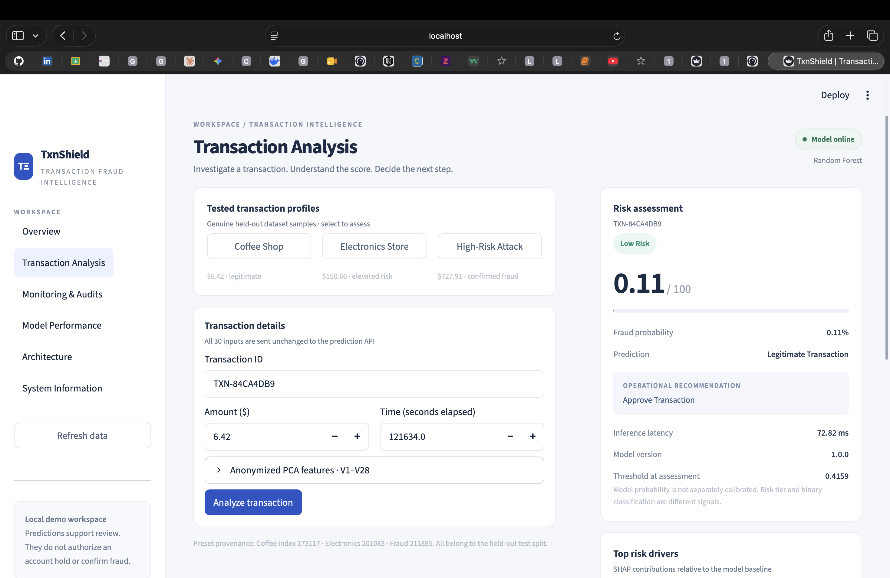
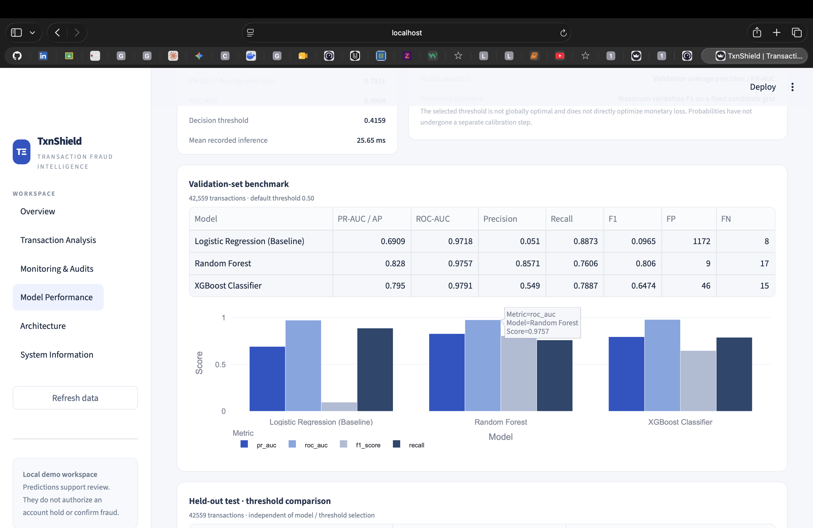
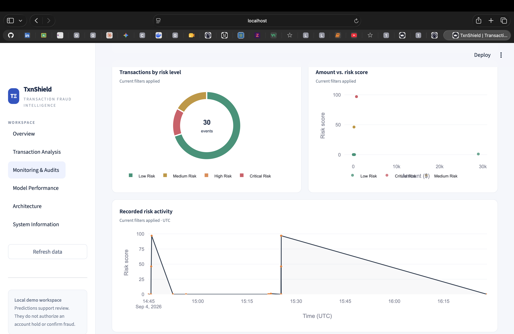

# 🛡️ TxnShield

### Transaction Fraud Intelligence

[](https://www.python.org/)
[](https://fastapi.tiangolo.com/)
[](https://streamlit.io/)
[](https://www.docker.com/)
[]()
[](LICENSE)

**TxnShield** is an end-to-end machine learning system for real-time transaction fraud detection and risk intelligence.

It combines fraud probability estimation, explainable risk scoring, SHAP-based model interpretation, FastAPI inference, SQLite audit logging, a Streamlit operations dashboard, automated testing, and Docker containerization.

---

## 🎯 Overview

TxnShield is designed to detect potentially fraudulent financial transactions using machine learning.

The project demonstrates a complete ML engineering workflow, including:

- preprocessing
- model training
- model comparison
- threshold tuning
- fraud-risk scoring
- explainability
- API serving
- audit logging
- dashboard monitoring
- automated testing
- Docker deployment

---
## 🖥️ Dashboard Preview

### Overview


### Transaction Analysis


### Model Performance


### Monitoring & Audits


---

## ✨ Key Features

- Logistic Regression, Random Forest, and XGBoost benchmarking
- Leakage-safe preprocessing
- Class imbalance handling
- Validation-tuned threshold
- Real-time fraud probability prediction
- 0–100 risk score
- Low, Medium, High, and Critical risk tiers
- SHAP explainability
- FastAPI backend
- SQLite audit trail
- Streamlit dashboard
- Batch predictions
- Model health monitoring
- Docker Compose support
- 33 automated tests

---

## 📊 Dataset

TxnShield uses the Credit Card Fraud Detection dataset.

### Dataset Summary

- Total transactions: 284,807
- Legitimate transactions: 284,315
- Fraudulent transactions: 492
- Fraud rate: approximately 0.173%
- Imbalance ratio: approximately 577:1

### Features

- `Time`
- `Amount`
- `V1` to `V28`
- `Class`

`V1` through `V28` are anonymized PCA-transformed features.

Their original real-world meanings are not provided in the public dataset.

---

## 🧠 Machine Learning Models

TxnShield compares:

### Logistic Regression

Used as the baseline model.

### Random Forest

Selected as the primary model based on validation performance.

### XGBoost

Used as another non-linear boosting-based candidate.

---

## 📈 Model Evaluation

Because fraud detection is highly imbalanced, accuracy alone is not sufficient.

TxnShield evaluates models using:

- Precision
- Recall
- F1 Score
- PR-AUC
- ROC-AUC
- False Positives
- False Negatives

### Validation Benchmark

| Model | PR-AUC | ROC-AUC | Precision | Recall | F1 |
|---|---:|---:|---:|---:|---:|
| Logistic Regression | 0.6909 | 0.9718 | 0.0510 | 0.8873 | 0.0965 |
| **Random Forest** | **0.8280** | 0.9757 | **0.8571** | 0.7606 | **0.8060** |
| XGBoost | 0.7950 | **0.9791** | 0.5490 | 0.7887 | 0.6474 |

Random Forest was selected because it achieved the strongest validation PR-AUC and F1 balance among the tested models.

---

## 🎯 Decision Threshold

The default classification threshold is:

```text
0.50
```

TxnShield uses a validation-tuned threshold of:

```text
0.4159
```

This threshold was selected using validation data.

It should be treated as a **validation-tuned threshold**, not as a universally optimal threshold.

### Held-Out Test Comparison

| Metric | Threshold 0.50 | Threshold 0.4159 |
|---|---:|---:|
| Precision | 0.8209 | 0.7887 |
| Recall | 0.7746 | 0.7887 |
| F1 Score | 0.7971 | 0.7887 |
| True Positives | 55 | 56 |
| False Negatives | 16 | 15 |
| False Positives | 12 | 15 |

Lowering the threshold improves recall slightly and reduces missed fraud, while increasing false positives.

---

## 💡 Risk Scoring

TxnShield converts fraud probability into a 0–100 risk score.

```text
Risk Score = Fraud Probability × 100
```

### Risk Tiers

| Risk Tier | Score Range | Suggested Action |
|---|---:|---|
| Low Risk | 0–29 | Normal processing |
| Medium Risk | 30–69 | Step-up authentication |
| High Risk | 70–89 | Manual analyst review |
| Critical Risk | 90–100 | Escalate for urgent manual review |

The binary fraud classification threshold and the risk-tier boundaries are separate concepts.

Suggested actions are advisory and are intended to support human review.

---

## 🔍 Explainable AI with SHAP

TxnShield uses SHAP to explain individual model predictions.

SHAP shows how each feature contributes to the model output relative to a baseline.

- Positive contribution → pushes the model toward higher fraud risk
- Negative contribution → pushes the model toward lower fraud risk

Because `V1` through `V28` are anonymized PCA components, TxnShield keeps their labels neutral instead of assigning unsupported real-world meanings.

---

## 🚀 FastAPI Backend

TxnShield exposes REST endpoints using FastAPI.

### Core Endpoints

```text
GET    /health
POST   /predict
POST   /batch-predict
GET    /history
GET    /metrics
DELETE /history
```

### Endpoint Purpose

#### `GET /health`

Returns service and model health information.

#### `POST /predict`

Scores a single transaction and stores the result in the audit database.

#### `POST /batch-predict`

Scores multiple transactions.

#### `GET /history`

Returns recent audit records.

#### `GET /metrics`

Returns model evaluation information.

#### `DELETE /history`

Clears local demo audit history.

---

## 📦 Example Prediction Payload

TxnShield expects transaction features matching the model input schema.

```json
{
  "transaction_id": "TXN-001",
  "Time": 121634.0,
  "Amount": 6.42,
  "V1": 2.1615,
  "V2": -0.0827,
  "V3": -2.4382,
  "V4": 0.2243,
  "V5": 0.7392,
  "V6": -0.9843,
  "V7": 0.5755,
  "V8": -0.3377,
  "V9": 0.8001,
  "V10": 0.0597,
  "V11": -2.1355,
  "V12": -1.2218,
  "V13": -2.3872,
  "V14": 1.0712,
  "V15": 0.1743,
  "V16": -0.5358,
  "V17": -0.2903,
  "V18": -0.0305,
  "V19": 0.4980,
  "V20": -0.3929,
  "V21": 0.0434,
  "V22": 0.2575,
  "V23": -0.1740,
  "V24": -1.0771,
  "V25": 0.6042,
  "V26": 0.0073,
  "V27": -0.0668,
  "V28": -0.0902
}
```

Example request:

```bash
curl -X POST http://127.0.0.1:8000/predict \
  -H "Content-Type: application/json" \
  -d @transaction.json
```

---

## 💻 Streamlit Dashboard

TxnShield includes six dashboard pages:

1. Overview
2. Transaction Analysis
3. Monitoring & Audits
4. Model Performance
5. Architecture
6. System Information

### Branding

```text
TΞ
TxnShield
TRANSACTION FRAUD INTELLIGENCE
```

The dashboard provides:

- transaction analysis
- fraud probability
- risk score
- risk tier
- SHAP explanations
- audit history
- model performance
- system health

---

## 🗃️ Database & Audit Trail

TxnShield uses SQLite and SQLAlchemy for local audit persistence.

Successful predictions can store:

- transaction ID
- timestamp
- fraud probability
- prediction
- risk score
- risk level
- suggested decision
- latency
- model version
- transaction feature payload

Automated tests verify consistency between API responses and stored audit records.

Audit records represent model assessments and should not be interpreted as confirmed fraud cases.

---

## 🛠️ Installation

### Prerequisites

- Python 3.12 recommended
- Git
- pip
- Docker Desktop for container execution

On macOS, XGBoost may require:

```bash
brew install libomp
```

### Clone Repository

```bash
git clone https://github.com/haritvishu4/TxnShield.git
cd TxnShield
```

### Create Virtual Environment

```bash
python3.12 -m venv .venv
source .venv/bin/activate
```

### Install Dependencies

```bash
pip install --upgrade pip setuptools wheel
pip install -r requirements.txt
pip install -e .
```

---

## 🚀 Run Locally

### Start FastAPI

Terminal 1:

```bash
uvicorn api.app:app --host 0.0.0.0 --port 8000 --reload
```

API documentation:

```text
http://localhost:8000/docs
```

### Start Streamlit

Terminal 2:

```bash
streamlit run dashboard/app.py
```

Dashboard:

```text
http://localhost:8501
```

---

## 🧪 Testing & Verification

TxnShield includes automated unit and integration tests covering:

- API health
- valid prediction requests
- invalid inputs
- batch predictions
- audit history
- history reset
- dashboard state
- preset synchronization
- all six dashboard pages
- filtering
- audit consistency
- model training
- model evaluation
- threshold optimization
- preprocessing
- leakage prevention
- risk scoring

Run:

```bash
pytest -v
```

### Latest Verified Result

```text
33 passed, 3 warnings in 4.10s
```

The three warnings originate from SHAP plotting dependencies and are deprecation warnings, not test failures.

---

## 🐳 Docker Containerization

TxnShield has been successfully verified using Docker Compose.

### Build and Start

```bash
docker compose up --build
```

This launches:

- FastAPI backend
- Streamlit dashboard
- model artifacts
- SHAP explainer
- SQLite audit persistence

### Services

FastAPI:

```text
http://localhost:8000
```

API documentation:

```text
http://localhost:8000/docs
```

TxnShield dashboard:

```text
http://localhost:8501
```

### Verified Docker Startup

The current containerized environment successfully verified:

```text
API service started
Database initialized
Model loaded
SHAP explainer initialized
Health endpoint returned 200 OK
Dashboard started successfully
```

### Stop Containers

```bash
docker compose down
```

After the image has already been built, start it again with:

```bash
docker compose up
```

Use:

```bash
docker compose up --build
```

when Docker configuration or image dependencies have changed.

---

## 📁 Project Structure

```text
TxnShield/
│
├── api/
├── config/
├── dashboard/
│   ├── app.py
│   ├── components.py
│   ├── pages.py
│   ├── state.py
│   └── theme.css
├── data/
├── models/
├── notebooks/
├── scripts/
├── src/
├── tests/
│
├── Dockerfile
├── docker-compose.yml
├── LICENSE
├── pytest.ini
├── requirements.txt
├── requirements-runtime.txt
├── setup.py
└── README.md
```

---

## 🎓 Interview Summary

### What is TxnShield?

TxnShield is an end-to-end machine learning transaction fraud detection and risk intelligence prototype.

### What are V1–V28?

They are anonymized PCA-transformed numerical transaction features.

### Why is accuracy not enough?

Because legitimate transactions heavily outnumber fraudulent transactions, so a high accuracy score can hide poor fraud detection.

### Why was Random Forest selected?

It achieved the strongest validation PR-AUC and F1 balance among the tested candidate models.

### What is 0.4159?

It is a validation-tuned fraud-classification threshold.

### Why use a threshold below 0.50?

It can improve fraud recall and reduce missed fraud at the cost of additional false positives.

### What does SHAP do?

SHAP explains how individual features contributed to a model prediction.

### Can a transaction ID alone predict fraud?

No. The model requires transaction features. A production system could use the transaction ID to retrieve those features from another system.

### Is TxnShield production-ready for a bank?

No. TxnShield is an end-to-end ML engineering prototype. A real financial deployment would require additional security, governance, infrastructure, monitoring, compliance, and payment-system integration.

---

## ⚠️ Limitations

- TxnShield predicts probabilistic risk, not absolute fraud truth.
- `V1` through `V28` are anonymized PCA features.
- A transaction ID alone is not sufficient for prediction.
- Model probabilities are not separately calibrated using methods such as Platt scaling or isotonic regression.
- SQLite is intended for local/demo use.
- Real payment-provider integration is not included.
- Production authentication and authorization are not currently implemented.
- A real financial deployment would require stronger security, monitoring, governance, and compliance controls.

---

## 🔮 Future Roadmap

Potential upgrades include:

- Kafka / Redpanda streaming
- Evidently AI drift monitoring
- automated retraining
- probability calibration
- real transaction feature pipelines
- secure authentication
- cloud deployment
- PostgreSQL
- graph-based fraud-ring detection
- Neo4j
- PyTorch Geometric

---

## 🔐 Responsible Use

TxnShield is designed as an educational and portfolio-focused machine learning engineering project.

Predictions should be treated as advisory risk signals.

A production financial fraud platform would additionally require:

- authentication
- authorization
- encryption
- secrets management
- compliance controls
- privacy protections
- monitoring
- model governance
- drift detection
- human-review workflows
- secure payment-provider integration

---

## 📜 License

This project is licensed under the MIT License.

See:

```text
LICENSE
```

for details.

---

## 🔗 Repository

https://github.com/haritvishu4/TxnShield

---

# ⭐ TxnShield

**Transaction Fraud Intelligence**

Machine Learning · FastAPI · Streamlit · SHAP · SQLite · Docker