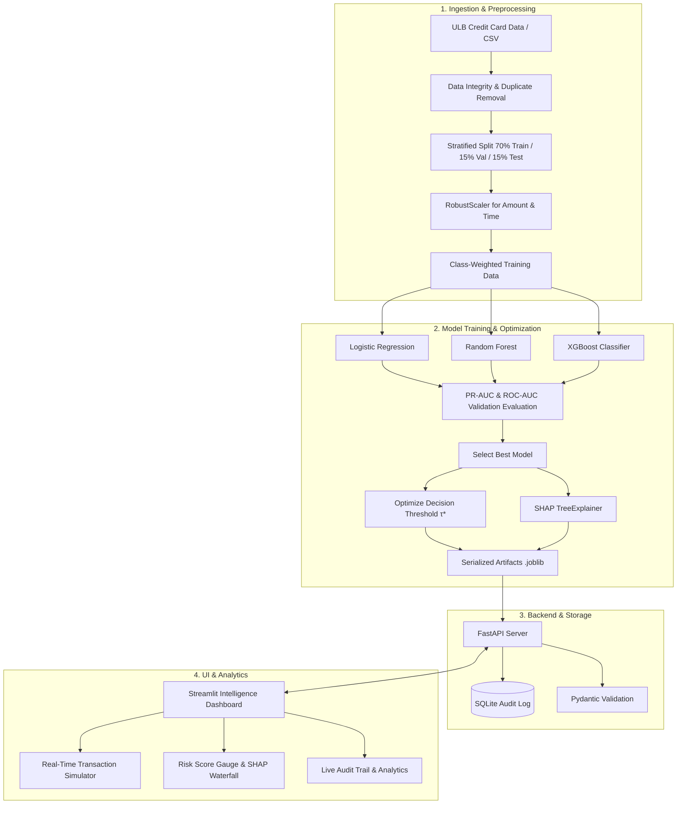

# 🛡️ Real-Time Fraud Detection and Risk Intelligence System

[](https://www.python.org/downloads/release/python-3120/)
[](https://fastapi.tiangolo.com)
[](https://streamlit.io)
[](https://www.docker.com)
[](https://opensource.org/licenses/MIT)

An end-to-end, production-grade Machine Learning Engineering system designed to detect potentially fraudulent financial transactions, compute calibrated risk scores (0–100), classify multi-tiered business risk levels, explain decisions via SHAP, serve real-time predictions with sub-20ms latency through a FastAPI REST service, persist transaction audits in SQLite, and visualize telemetry on an interactive Streamlit dashboard.

---

## 📑 Table of Contents
1. [Overview & Problem Statement](#-overview--problem-statement)
2. [Key System Features](#-key-system-features)
3. [End-to-End Architecture](#-end-to-end-architecture)
4. [Dataset & Exploratory Data Analysis](#-dataset--exploratory-data-analysis)
5. [Anti-Leakage Preprocessing](#-anti-leakage-preprocessing)
6. [Machine Learning Models & Imbalance Handling](#-machine-learning-models--imbalance-handling)
7. [Evaluation Metrics & Model Comparison](#-evaluation-metrics--model-comparison)
8. [Decision Threshold Optimization](#-decision-threshold-optimization)
9. [Dynamic Risk Scoring Engine](#-dynamic-risk-scoring-engine)
10. [Explainable AI with SHAP](#-explainable-ai-with-shap)
11. [FastAPI REST Backend](#-fastapi-rest-backend)
12. [Streamlit Monitoring Dashboard](#-streamlit-monitoring-dashboard)
13. [Database & Audit Trail](#-database--audit-trail)
14. [Installation & Setup](#-installation--setup)
15. [Testing & Verification](#-testing--verification)
16. [Docker Containerization](#-docker-containerization)
17. [Interview Q&A Cheatsheet](#-interview-qa-cheatsheet)
18. [Limitations & Future Roadmap](#-limitations--future-roadmap)

---

## 🎯 Overview & Problem Statement

Credit card fraud represents billions of dollars in annual global losses. However, building an ML system for fraud detection faces fundamental engineering and mathematical challenges:

1. **Extreme Class Imbalance**: Legitimate transactions constitute ~99.83% of all traffic, while fraud represents only ~0.17%. A naive model predicting "Legitimate" for every transaction achieves 99.83% accuracy while catching 0% of fraud.
2. **Asymmetric Error Costs**: A False Negative (missing a \$3,000 fraud ring) damages financial institutions and customers, whereas a False Positive (prompting a 2FA code) is merely a minor friction point.
3. **Black-Box Skepticism**: Financial compliance and risk analysts cannot act on an opaque number; they require auditable, explainable reasons why a transaction was flagged.
4. **Latency Requirements**: Online authorization decisions must complete within milliseconds without degrading checkout throughput.

This project delivers a complete software system solving each of these challenges.

---

## ✨ Key System Features

- **Multi-Model Benchmark**: Trains and compares Logistic Regression (baseline), Random Forest, and XGBoost with dynamic class weighting.
- **Strict Leakage Prevention**: Preprocessing scalers are fit strictly on training splits before transforming validation and test folds.
- **Threshold Optimization**: Replaces the arbitrary 0.5 decision threshold with a validation-tuned threshold ($\tau^* = 0.4159$) calibrated on validation PR curves to maximize $F_1$ and prioritize fraud recall over missed detections.
- **Dynamic Risk Intelligence Engine**: Converts raw probabilities into a 0–100 Risk Score categorized into 4 actionable business tiers:
  - 🟢 **Low Risk (0–29)**: Auto-approve.
  - 🟡 **Medium Risk (30–69)**: Step-up authentication (2FA / OTP).
  - 🟠 **High Risk (70–89)**: Route to manual fraud analyst review queue.
  - 🔴 **Critical Risk (90–100)**: Critical Risk – Hold for manual review / Escalate to fraud analyst.
- **Explainable AI (SHAP)**: Provides local feature attribution for every transaction, identifying exact factors pushing the score up or down.
- **High-Performance FastAPI**: RESTful endpoints with Pydantic v2 input validation, swagger documentation (`/docs`), and single/batch inference.
- **Transaction Audit Database**: SQLite + SQLAlchemy persistence tracking every evaluated transaction, risk level, decision, and latency.
- **Interactive Streamlit Dashboard**: Live simulation sandbox with presets, risk gauge visualizations, SHAP waterfall plots, and real-time audit logs.
- **Automated Pytest Suite**: 13 unit and integration tests covering data integrity, preprocessing, risk calculation, and API endpoints.
- **Dockerized Deployment**: Production Dockerfile and docker-compose orchestration.

---

## 🏗️ End-to-End Architecture



---

## 📊 Dataset & Exploratory Data Analysis

The project utilizes the benchmark **Credit Card Fraud Detection Dataset** (ULB Machine Learning Group):
- **Total Transactions**: 284,807
- **Legitimate Transactions (Class 0)**: 284,315 (99.827%)
- **Fraudulent Transactions (Class 1)**: 492 (0.173%)
- **Imbalance Ratio**: 577 to 1
- **Features**: 
  - `Time`: Elapsed seconds from first transaction.
  - `V1` to `V28`: Principal components obtained via PCA due to confidentiality.
  - `Amount`: Transaction monetary amount.
  - `Class`: 1 for fraudulent, 0 for legitimate.

Key EDA findings:
- Fraudulent transaction amounts have higher variance and distinct clustering compared to legitimate purchases.
- Predictive PCA components (such as `V14`, `V10`, `V12`, `V17`, `V4`) display statistically significant divergence between fraud and legitimate transactions.

---

## 🔬 Anti-Leakage Preprocessing

Data leakage is a fatal flaw in fraud models. We prevent it via:
1. **Deduplication**: Removing duplicate rows before splitting.
2. **Stratified Splitting**: 70% Train, 15% Validation, 15% Test, preserving the 0.17% class proportion across all folds.
3. **Outlier-Resistant Scaling**: `RobustScaler` scales `Amount` and `Time` using median and interquartile range (IQR), immune to extreme financial outliers.
4. **Strict Isolation**: Scalers are `fit()` strictly on `X_train`, and subsequently applied via `transform()` to `X_val` and `X_test`.

---

## 🧠 Machine Learning Models & Imbalance Handling

We train three distinct architectures with class balancing:

1. **Logistic Regression (Baseline)**: Fast, linear, calibrated with `class_weight='balanced'`.
2. **Random Forest**: Ensemble of 100 decision trees with balanced bootstrapping.
3. **XGBoost Classifier**: Extreme gradient boosting with dynamic `scale_pos_weight = N_legit / N_fraud` and `eval_metric='aucpr'`.

---

## 📈 Evaluation Metrics & Model Comparison

Because accuracy is misleading on imbalanced datasets (~0.17% positive rate), models are evaluated using **PR-AUC (Average Precision)**, **ROC-AUC**, **Recall**, **Precision**, and **$F_1$-Score**.

### 1. Candidate Benchmark (Validation Set — 42,559 transactions)
Evaluated on the 15% stratified Validation partition at the default baseline threshold ($\tau = 0.50$) to compare algorithms and select the production architecture:

| Model | PR-AUC (Avg Precision) | ROC-AUC | Precision | Recall | $F_1$-Score | False Positives | False Negatives |
| :--- | :---: | :---: | :---: | :---: | :---: | :---: | :---: |
| **Logistic Regression (Baseline)** | 0.6909 | 0.9718 | 0.0510 | **0.8873** | 0.0965 | 1,172 | **8** |
| **Random Forest (Selected)** | **0.8280** | **0.9757** | **0.8571** | 0.7606 | **0.8060** | **9** | 17 |
| **XGBoost Classifier** | 0.7950 | 0.9791 | 0.5490 | 0.7887 | 0.6474 | 46 | 15 |

*Key takeaway:* Random Forest generated only **9 false alarms** out of 42,559 validation transactions while delivering the highest PR-AUC (0.8280).

---

## 🎯 Decision Threshold Optimization & Generalization

### Optimization Objective
In credit card fraud operations, a missed \$2,000 fraud attack (False Negative) costs vastly more than an OTP prompt sent to a customer (False Positive). Therefore, the threshold optimizer sweeps candidate thresholds $\tau \in [0.01, 0.99]$ on the **Validation Set** to calibrate a **Validation-Tuned Decision Threshold** ($\tau^* = 0.4159$) prioritizing Recall over missed fraud.

### 2. Generalization Performance (Unseen Held-Out Test Set — 42,559 transactions)
When evaluating the selected Random Forest on the unseen held-out test split, comparing the baseline threshold against the validation-tuned cutoff:

| Metric | Default Threshold ($\tau = 0.50$) | Validation-Tuned Threshold ($\tau^* = 0.4159$) | Operational Impact |
| :--- | :---: | :---: | :--- |
| **Precision** | **0.8209** | 0.7887 | Slight drop due to 3 additional alerts across 42,559 txns |
| **Recall** | 0.7746 | **0.7887** | **+1.41% increase** in fraud detection coverage |
| **$F_1$-Score** | **0.7971** | 0.7887 | Balanced harmonic mean across trade-off |
| **Frauds Caught (TP)** | 55 / 71 | **56 / 71** | **1 additional fraud attack intercepted** |
| **Missed Fraud (FN)** | 16 | **15** | **Reduced costly false negatives** |
| **False Alarms (FP)** | **12** | 15 | Manageable volume (15 out of 42,488 legit txns) |

> [!NOTE]
> We explicitly define $\tau^* = 0.4159$ as a *validation-tuned threshold prioritizing fraud recall* rather than claiming global optimality across all transaction regimes. In production, this threshold is continuously monitored and tuned as business loss matrices evolve.

---

## 💡 Dynamic Risk Scoring Engine

Model output $P(\text{fraud}) \in [0, 1]$ is translated into a 0–100 integer/float risk score:

$$\text{Risk Score} = \text{round}(P(\text{fraud}) \times 100, 2)$$

| Risk Tier | Score Range | Action | Description |
| :--- | :---: | :--- | :--- |
| **Low Risk** | 0 – 29 | **Approve Transaction** | Instant approval, frictionless customer checkout. |
| **Medium Risk** | 30 – 69 | **Step-Up Authentication** | Prompt cardholder with SMS OTP / biometric verification. |
| **High Risk** | 70 – 89 | **Analyst Review** | Route transaction to fraud ops queue for manual inspection. |
| **Critical Risk** | 90 – 100 | **Critical Risk – Hold for Manual Review** | Escalate to fraud analyst for urgent review before clearing. |

---

## 🔍 Explainable AI with SHAP

Using `shap.TreeExplainer`, each transaction prediction is decomposed into additive feature attributions:

$$\text{Log-Odds}(\text{Fraud}) = \phi_0 + \sum_{i=1}^{M} \phi_i$$

Where $\phi_i$ is the SHAP value for feature $i$.
- **Positive $\phi_i$**: Factors increasing suspicion (e.g., abnormally negative $V_{14}$ combined with sudden high transaction velocity $V_4$).
- **Negative $\phi_i$**: Factors reassuring legitimacy (e.g., familiar time profile and normal transaction amounts).

---

## 🚀 FastAPI REST Backend

The API provides production-grade endpoints documented via OpenAPI:

### Endpoints
- `GET /health`: Health status, model family, threshold, version.
- `POST /predict`: Real-time transaction scoring with SHAP explanations and audit logging.
- `POST /batch-predict`: Vectorized multi-transaction evaluation.
- `GET /history`: Query logged audit transactions with filtering by risk tier.
- `GET /metrics`: Model evaluation summary and comparison benchmarks.

### Sample Request
```bash
curl -X POST "http://127.0.0.1:8000/predict" \
     -H "Content-Type: application/json" \
     -d '{
       "transaction_id": "TXN-89412",
       "Time": 45000.0,
       "Amount": 1450.00,
       "V4": 3.8,
       "V10": -2.9,
       "V14": -4.2
     }'
```

### Sample Response
```json
{
  "transaction_id": "TXN-89412",
  "is_fraud": true,
  "prediction": "Potential Fraud",
  "fraud_probability": 0.8841,
  "risk_score": 88.41,
  "risk_level": "High Risk",
  "decision": "Flag for Manual Fraud Analyst Review",
  "badge_color": "orange",
  "latency_ms": 7.42,
  "top_risk_drivers": [
    {
      "feature": "V14",
      "shap_value": 0.3542,
      "feature_value": -4.2,
      "impact": "Increases Risk"
    }
  ],
  "model_version": "1.0.0"
}
```

---

## 💻 Streamlit Monitoring Dashboard

The web dashboard provides four functional areas:
1. **Interactive Simulator**: Test hypothetical transactions or quick-load presets (Coffee Shop, High-Value Electronics, Coordinated Attack Pattern).
2. **Risk Gauge & SHAP Chart**: Visual speedometer and waterfall chart explaining feature drivers.
3. **Transaction Monitoring**: Real-time table and analytics charts loaded from SQLite.
4. **Model Performance**: Interactive confusion matrix and PR/ROC comparison curves.

---

## 🛠️ Installation & Setup

### Prerequisites
- Python 3.10+ (Python 3.12 recommended)
- `brew install libomp` (macOS users running XGBoost)

### Quick Start
```bash
# 1. Clone repository
git clone https://github.com/your-username/fraud-detection-system.git
cd fraud-detection-system

# 2. Create virtual environment
python3.12 -m venv .venv
source .venv/bin/activate

# 3. Install dependencies & package
pip install --upgrade pip setuptools wheel
pip install -r requirements.txt
pip install -e .

# 4. Execute End-to-End Pipeline (Ingest, Train, Benchmark, Optimize, Serialize)
python scripts/run_pipeline.py

# 5. Seed sample historical transactions for the dashboard
python scripts/seed_db.py

# 6. Start FastAPI Backend (Terminal 1)
uvicorn api.app:app --host 0.0.0.0 --port 8000 --reload

# 7. Start Streamlit Dashboard (Terminal 2)
streamlit run dashboard/app.py
```

Open `http://localhost:8501` to view the dashboard and `http://localhost:8000/docs` to test the API.

---

## 🧪 Testing & Verification

Run the automated test suite with pytest:
```bash
pytest tests/ -v
```

---

## 🐳 Docker Containerization

Run the entire multi-container stack (FastAPI + Streamlit) with a single command:
```bash
docker-compose up --build
```
- API: `http://localhost:8000`
- Dashboard: `http://localhost:8501`

---

## 🎓 Interview Q&A Cheatsheet

| Question | Engineering Answer |
| :--- | :--- |
| **Why is fraud detection an imbalanced problem?** | Legitimate transactions outnumber fraud by over 500 to 1. Traditional classifiers optimizing accuracy predict the majority class and fail to detect critical attacks. |
| **Why isn't accuracy sufficient?** | A naive dummy model predicting 0 for every transaction achieves 99.83% accuracy while catching 0% of fraud cases. Precision-Recall AUC (PR-AUC) and Recall are vastly more informative. |
| **What is the trade-off between Precision and Recall in fraud?** | High Recall ensures we catch as many stolen cards as possible (minimizing direct monetary fraud loss). High Precision ensures we don't bombard legitimate users with false declines (reducing customer friction and churn). |
| **How did you prevent data leakage?** | Scalers were fitted strictly on the 70% training split. Validation and test splits were transformed using the frozen training parameters. Deduplication was performed before splitting. |
| **Why did you use Logistic Regression as a baseline?** | It establishes a fast, calibrated benchmark and verifies that complex non-linear models (Random Forest, XGBoost) yield genuine marginal performance gains. |
| **How did you tune the decision threshold?** | Swept candidate thresholds on the **Validation Set** to find $\tau^* = 0.4159$, prioritizing fraud recall and reducing missed fraud (False Negatives from 16 to 15 on held-out test data) while balancing $F_1$. |
| **How does your risk score work?** | Calibrated model probabilities are scaled to 0–100 and mapped into 4 actionable business tiers (Low, Medium, High, Critical) with explicit actions (Approve, 2FA, Manual Review, Hold for Review). |
| **How does SHAP work in this system?** | Using TreeSHAP, it computes Shapley values quantifying the marginal contribution of each feature to the final prediction log-odds. |

---

## ⚠️ Important Limitations & Future Roadmap

### Limitations
- The system predicts *probabilistic risk*, not absolute truth. All outputs are labeled as "Potential Fraud" or "High Risk - Review Recommended".
- The PCA features ($V_1 - V_{28}$) anonymize original banking fields (like merchant category or device fingerprint).

### Future Roadmap
- **Streaming Pipeline**: Apache Kafka / Redpanda event streaming simulation.
- **Drift Detection**: Evidently AI integration for feature and concept drift monitoring.
- **Automated Retraining**: Airflow or Prefect orchestration DAGs.
- **Graph Neural Networks**: Graph-based fraud ring detection (Neo4j / PyG).
